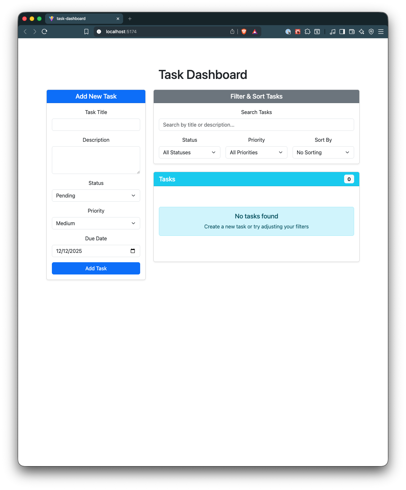
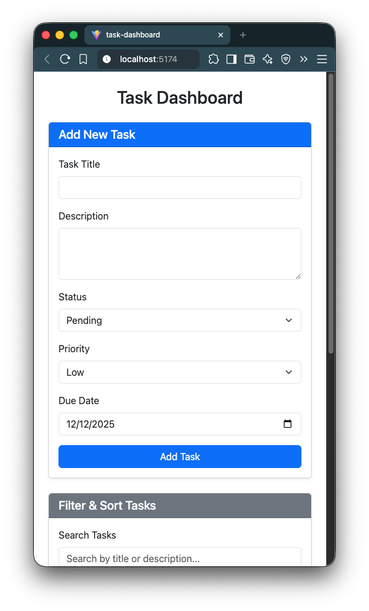

# 📋 Task Dashboard

A modern, full-featured task management application built with **React, TypeScript, and Bootstrap 5**, featuring task creation, filtering, sorting, and **localStorage persistence**. Manage your tasks efficiently with a clean, responsive interface that works seamlessly across all devices.

---

## 🌟 Features

* **Create, Edit, Delete Tasks** – Full CRUD operations for task management
* **Task Filtering** – Filter tasks by status (Pending, In Progress, Completed) and priority (Low, Medium, High)
* **Search Functionality** – Search tasks by title or description
* **Advanced Sorting** – Sort by title (A-Z, Z-A), due date (Earliest/Latest), or priority (High to Low, Low to High)
* **Status Management** – Update task status directly from the task card
* **Priority Levels** – Assign and visualize task priority with color-coded badges
* **Due Date Tracking** – Set and view due dates for all tasks
* **Responsive Design** – Beautiful Bootstrap 5 UI that adapts to all screen sizes
* **Persistent Storage** – All tasks are saved in `localStorage` and persist across page reloads
* **Real-time Updates** – Task count and filtered results update instantly

---

## 📂 Project Structure

```
task-dashboard/
│
├── public/
│   ├── screenshots/
│   │   ├── desktop.png     # Desktop screenshot
│   │   └── mobile.png      # Mobile screenshot
│   └── vite.svg
│
├── src/
│   ├── components/
│   │   ├── Dashboard/
│   │   │   └── Dashboard.tsx      # Main dashboard container
│   │   ├── TaskForm/
│   │   │   └── TaskForm.tsx        # Task creation/edit form
│   │   ├── TaskFilter/
│   │   │   └── TaskFilter.tsx     # Filter and sort controls
│   │   ├── TaskList/
│   │   │   ├── TaskList.tsx        # Task list container
│   │   │   └── TaskItem.tsx        # Individual task card
│   │   ├── types/
│   │   │   └── index.ts            # TypeScript type definitions
│   │   └── utils/
│   │       └── taskUtils.ts         # Filtering and sorting utilities
│   ├── App.tsx                     # Main app component with state management
│   ├── App.css                     # App-specific styles
│   ├── main.tsx                    # Application entry point
│   └── index.css                   # Global styles
│
├── index.html                      # HTML template
├── package.json                    # Dependencies and scripts
├── tsconfig.json                    # TypeScript configuration
├── vite.config.ts                  # Vite build configuration
└── README.md                       # Project documentation
```

---

## ⚡ How to Use

### Installation

1. Clone the repository or download the project files
2. Install dependencies:
   ```bash
   npm install
   ```

### Running the Application

1. Start the development server:
   ```bash
   npm run dev
   ```
2. Open your browser and navigate to the URL shown in the terminal (typically `http://localhost:5173`)

### Using the Dashboard

1. **Create a Task:**
   - Fill out the "Add New Task" form on the left
   - Enter a title (required), description, select status and priority
   - Choose a due date
   - Click "Add Task"

2. **Filter Tasks:**
   - Use the search box to find tasks by title or description
   - Select a status filter (All, Pending, In Progress, Completed)
   - Select a priority filter (All, High, Medium, Low)
   - Choose a sort option from the dropdown

3. **Update Task Status:**
   - Use the status dropdown on any task card to change its status

4. **Delete a Task:**
   - Click the "Delete" button on any task card

5. **View Task Details:**
   - Each task card displays title, description, due date, priority, and status
   - Priority and status are shown with color-coded badges

---

## 🚀 Live Demo

> 🌐 **Live Demo:** [Click Here for Live Demo](https://jolly-daffodil-ea0f3e.netlify.app/)

> 💻 **Repository:** [View Source on GitHub](https://github.com/structbase/Task-Dashboard)

---

## 📸 Screenshots

### 🖥️ Desktop Layout



### 📱 Mobile Layout



---

## 🛠 Technologies Used

* **React 19.2** – Modern UI library for building interactive interfaces
* **TypeScript 5.9** – Type-safe JavaScript for better development experience
* **Bootstrap 5.3** – Responsive CSS framework for styling
* **Vite 7.2** – Fast build tool and development server
* **ESLint** – Code linting and quality assurance
* **LocalStorage API** – Client-side data persistence

---

## 💡 Key Features Explained

### Task Management
- **Create:** Add new tasks with title, description, status, priority, and due date
- **Read:** View all tasks with filtering and sorting options
- **Update:** Change task status directly from the task card
- **Delete:** Remove tasks with a single click

### Filtering & Sorting
- **Search:** Real-time search across task titles and descriptions
- **Status Filter:** Filter by task status (Pending, In Progress, Completed)
- **Priority Filter:** Filter by task priority (Low, Medium, High)
- **Sorting:** Multiple sort options including title, date, and priority

### Data Persistence
- All tasks are automatically saved to `localStorage`
- Tasks persist across browser sessions and page reloads
- No backend required – everything runs client-side

---

## 🎨 UI/UX Features

* **Responsive Grid Layout** – Adapts from desktop to mobile seamlessly
* **Color-Coded Badges** – Visual indicators for status and priority
* **Card-Based Design** – Clean, modern card layout for tasks
* **Form Validation** – Required field validation for task creation
* **Empty State Messages** – Helpful messages when no tasks are found
* **Real-Time Task Count** – Dynamic badge showing filtered task count

---

## 🔧 Development Notes

* This project is **purely client-side**; there is no backend server
* Data persists via **localStorage**, so clearing browser data will remove all tasks
* Built with **TypeScript** for type safety and better developer experience
* Uses **React Hooks** for state management
* **Bootstrap 5** provides all styling and responsive behavior

---

## 🏁 Credits & Resources

* [React Documentation](https://react.dev/)
* [TypeScript Handbook](https://www.typescriptlang.org/docs/)
* [Bootstrap 5 Documentation](https://getbootstrap.com/docs/5.3/)
* [Using localStorage with React Hooks](https://blog.logrocket.com/using-localstorage-react-hooks/)
* [MDN Web Docs – LocalStorage](https://developer.mozilla.org/en-US/docs/Web/API/Window/localStorage)
* [React Hooks Reference](https://react.dev/reference/react)
* [React useState() hook introduction](https://www.youtube.com/watch?v=SpDG283b4bw)
* [React tutorial for beginners - Playlist](https://www.youtube.com/watch?v=hn80mWvP-9g&list=PLZPZq0r_RZOMQArzyI32mVndGBZ3D99XQ)

---
## 📝 Reflection Document

In this project, I used React with TypeScript to build a structured task dashboard. TypeScript helped me define clear interfaces for tasks and component props, which made it easier to catch errors early and keep my code organized. I utilized React features such as state, props, controlled forms, and conditional rendering to manage user actions and present updates in real time.

A few challenges I faced were managing state across multiple components and keeping TypeScript types consistent as the app grew. I overcame this by planning my types in a single file and lifting state up to the parent component so data stayed in sync. Additionally, I reduced the amount of repetitive code by using utility functions to streamline the filtering and sorting logic.

In order to use component composition to assemble the user interface, I divided it up into manageable, reusable components such as TaskList, TaskForm, and TaskFilter. This simplified the dashboard's upkeep and updating. For state management, I kept the main task state in the Dashboard component and passed down handlers through props. This ensured a clean data flow and made it easier to update tasks, filter them, and manage form input.

---

## ✍️ Author

Developed by **Abenezer**

> Junior Developer

